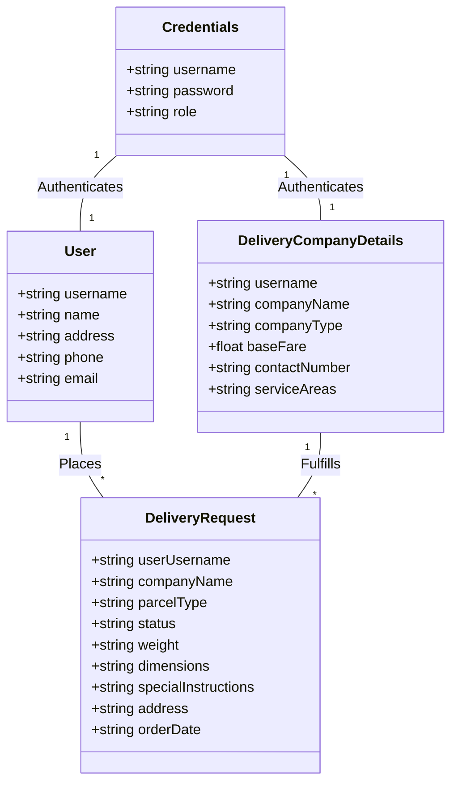

# Courier Management System - Comprehensive Guide

# Overview
**Courier Management System** is a robust C++ application that simulates a complete courier service ecosystem with three distinct user roles: customers, delivery companies, and administrators. This system handles end-to-end delivery management including order placement, status tracking, company management, and reporting.


# Key Features

# 1. Multi-Role Authentication System
- **Customers**: Place orders, track deliveries
- **Delivery Companies**: Update order statuses
- **Administrators**: Manage companies, generate reports
- Secure credential storage with role-based access control

### 2. Delivery Management
- Calendar-based delivery scheduling
- Parcel specification (type, weight, dimensions)
- Special instructions handling
- Real-time order status tracking (Pending → In Transit → Delivered)

# 3. Company Management
- Company registration with service details
- Blacklisting system for poor performers
- Complete removal of companies and associated data
- Service area specification

# 4. Reporting System
- User activity reports
- Delivery performance analytics
- Company blacklist management
- Comprehensive order histories

# 5. Data Persistence
- Text file storage for all entities
- Automatic data loading at startup
- Real-time data synchronization
- Backup-ready file formats

# File Structure
```
Courier-Management-System/
├── data/                   # Data storage files
│   ├── users.txt           # User credentials
│   ├── companies.txt       # Company details
│   ├── orders.txt          # Order records
│   ├── deliveries.txt      # Delivery requests
│   ├── userDetails.txt     # User profiles
│   └── company_details.txt # Company registration data
├── src/                    # Source code
│   ├── main.cpp            # Entry point
│   └── headers/            # Header files
├── docs/                   # Documentation
├── Makefile                # Build automation
└── README.md               # Project documentation
```

# Data Storage Design

# Users File Format (`users.txt`)
```
username password role
john_doe pass123 user
fast_delivery comp456 delivery
admin@bahria 02134251005 admin
```

# Orders File Format (`orders.txt`)
```
username|company|parcelType|status|weight|dimensions|specialInstructions|address|orderDate
john_doe|SpeedyCouriers|Document|Pending|0.5|20x15x5|Fragile|123 Main St|2025-05-30
```

# Company Details Format (`company_details.txt`)
```
username|companyName|companyType|baseFare|contactNumber|serviceAreas
fast_user|QuickDeliver|Express|8.50|555-1234|Downtown,Uptown
```

# Setup and Installation

# Prerequisites
- GCC/G++ compiler (MinGW for Windows)
- C++17 compatible environment
- Basic terminal/command prompt knowledge

# Compilation Instructions
1. Clone repository:
```bash
git clone https://github.com/yourusername/courier-management-system.git
```

2. Compile with G++:
```bash
g++ -std=c++17 src/main.cpp -o courier_system
```

3. Run executable:
```bash
./courier_system   # Linux/Mac
courier_system.exe # Windows
```

# First Run Configuration
The system will automatically create required data files if missing. Default admin credentials:
```
Username: admin
Password: 123
```

# Functional Workflows

# Customer Order Process
1. Login → Request Delivery → Enter parcel details → Select delivery date → Choose company → Confirm order
2. View order history with real-time status

# Delivery Company Process
1. Login → View assigned orders → Update status → Confirm changes
2. See all active deliveries in dashboard

# Administrator Process
1. Access reports → Manage companies → Blacklist underperformers
2. Remove companies with cascade deletion of related data

# Technical Specifications

# Algorithms Implemented
1. **Zeller's Congruence Algorithm** - Calculate day of week for calendar
2. **Data Serialization** - Custom pipe-separated value formatting
3. **Search Optimization** - Linear search with early termination
4. **Input Validation** - Multi-layer user input verification

# Data Structures


# Limitations and Future Improvements

# Current Limitations
- Fixed-size arrays limit scalability
- Plaintext password storage
- No geographical distance calculations
- Basic UI without graphics
- Limited error recovery mechanisms

# Planned Enhancements
1. **Database Integration** - Migrate from text files to SQLite
2. **Payment Processing** - Integrate payment gateway for transactions
3. **GIS Functionality** - Add Google Maps API for route optimization
4. **Email Notifications** - Implement SMTP for order updates
5. **Mobile Application** - React Native companion app
6. **Machine Learning** - Predictive delivery time estimation


Contribution Guidelines (GPL Compliance)
As a GPL-licensed project, all contributions must comply with these terms:
All derivative works must be licensed under GPL v3
Source code modifications must be clearly documented
Contributors must sign off on license agreement
